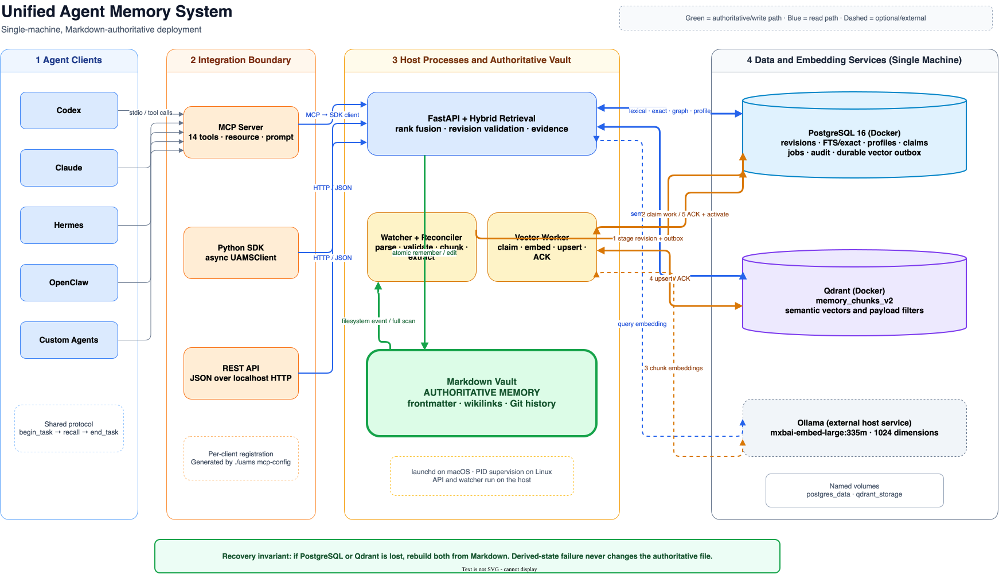
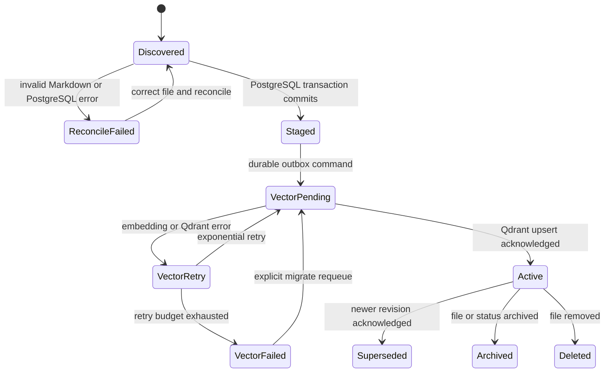

# Unified Agent Memory System (UAMS)

<div align="center">

[](https://pypi.org/project/uams-sdk/)
[](https://github.com/Shivamsharma6/unified_memory/actions)
[](https://opensource.org/licenses/MIT)
[](https://www.python.org/)
[](https://github.com/Shivamsharma6/unified_memory/discussions)

**A local-first, multi-agent shared brain combining Obsidian Markdown authority with PostgreSQL + Qdrant hybrid retrieval, bitemporal claim evolution, and MS-MARCO cross-encoder reranking.**

[Quickstart](#-quickstart-in-30-seconds) • [Why UAMS?](#-why-uams-vs-alternatives) • [Framework Adapters](#-framework-adapters) • [Architecture](#architecture-at-a-glance) • [Contributing](CONTRIBUTING.md)

</div>

---

> 🧪 **Join the Alpha Tester & Design Partner Program**: Are you building multi-agent systems with LangChain, CrewAI, AutoGen, or custom runtimes? [Read our Alpha Tester Guide](docs/community/ALPHA_TESTERS.md) to get direct architectural support and share feedback!

---

## ⚡ Quickstart in 30 Seconds

### 1. Start UAMS via Docker (1 Command)
```bash
# Clone and launch PostgreSQL (pgvector) + Qdrant + UAMS Control Plane
git clone https://github.com/Shivamsharma6/unified_memory.git
cd unified_memory
docker compose up -d
```

### 2. Install the Python SDK & Run Interactive Demo
```bash
pip install uams-sdk
uams-demo
```

### 3. Or Connect in 3 Lines of Python
```python
import asyncio
from uams_sdk import UAMSClient

async def main():
    client = UAMSClient(source_agent="Hermes", project="MyAgentTeam")
    
    # Store structured memory with automatic bitemporal distillation
    await client.store_memory(
        text="# Architecture Decision\n\nAdopted [[Qdrant]] for vector search and [[PostgreSQL]] for control plane.",
        category="semantic",
        sync=True
    )
    
    # Retrieve with hybrid cross-encoder reranking
    results = await client.search("What vector database was chosen?")
    print(results["results"][0]["text"])

asyncio.run(main())
```

---

## 📊 Why UAMS? (vs. Alternatives)

| Feature | **UAMS** | **Mem0** | **Zep** | **Graphiti** |
| :--- | :---: | :---: | :---: | :---: |
| **Authoritative Source of Truth** | **Human-Readable Markdown (Obsidian)** | Opaque Cloud / JSON | Postgres/Graph DB | Neo4j / Knowledge Graph |
| **Inspectable Without Special Tools** | **Yes** (open in Obsidian / Vim) | No | No | No |
| **Bitemporal Claims & Contradictions** | **Yes** (`valid_from`/`valid_to`/invalidation) | No | No | Yes |
| **Multi-Stage Hybrid Retrieval** | **FTS + Qdrant + Sigmoid Cross-Encoder** | Vector Only | Hybrid Search | Graph + Vector |
| **Multi-Agent Identity & Provenance** | **Yes** (`source_agent` + per-agent profiles) | User-Centric | Session-Centric | Entity-Centric |
| **Local-First & Offline Privacy** | **100% Local (Docker / POSIX)** | Cloud Dependent | Cloud/Self-Hosted | Self-Hosted |
| **Optimistic Concurrency Control** | **Yes** (HTTP 409 on content hash mismatch) | No | No | No |

---

## 🔌 Framework Adapters

Drop UAMS directly into your agent stack with zero friction:

### LangChain / LangGraph
```python
from uams_sdk.adapters.langchain import UAMSLangChainRetriever, UAMSLangChainChatMessageHistory

# Drop-in Retriever
retriever = UAMSLangChainRetriever(limit=5, source_agent="LangChainAgent")
docs = retriever.get_relevant_documents("What were our architecture decisions?")

# Drop-in Chat History
history = UAMSLangChainChatMessageHistory(session_id="session_01")
history.add_message("user", "We decided to migrate to Postgres 16")
```

### CrewAI
```python
from uams_sdk.adapters.crewai import UAMSCrewAIMemoryStorage

memory_storage = UAMSCrewAIMemoryStorage(source_agent="LeadArchitect", project="AutoCrew")
memory_storage.save("Completed database migration task", metadata={"task": "DBMigration"})
```

### LlamaIndex
```python
from uams_sdk.adapters.llamaindex import UAMSLlamaIndexRetriever

retriever = UAMSLlamaIndexRetriever(limit=5)
nodes = retriever.retrieve("Retrieve recent deployment procedures")
```

### Claude Desktop & Cursor (MCP Integration)
Add UAMS as a Model Context Protocol tool in `claude_desktop_config.json`:
```json
{
  "mcpServers": {
    "uams": {
      "command": "uams-mcp",
      "env": {
        "UAMS_BASE_URL": "http://localhost:8000"
      }
    }
  }
}
```

---

## What UAMS Guarantees

- **One shared memory:** Every connected agent uses the same vault and retrieval API.
- **Markdown authority:** The canonical record is Markdown with YAML frontmatter. It is readable in Obsidian, reviewable in Git, and recoverable without a database export.
- **Transactional current state:** PostgreSQL owns document identity, revisions, current-versus-historical state, full-text search, profiles, graph evidence, jobs, and the vector outbox.
- **Semantic recall:** Qdrant owns the rebuildable `memory_chunks_v2` vector projection used to find conceptually similar text.
- **Safe revision activation:** A new Markdown revision does not become current until its complete vector projection is acknowledged. The previous active revision remains searchable if embedding or Qdrant delivery fails.
- **Evidence-bearing results:** Normal retrieval returns `memory_id`, `revision_id`, source path, and chunk evidence and rejects superseded, archived, and deleted revisions.
- **Local-by-default boundaries:** The API, PostgreSQL, and Qdrant bind to loopback addresses by default.


The architectural contract is:

> **Markdown is authoritative. PostgreSQL and Qdrant are rebuildable projections. PostgreSQL owns exact/current/lifecycle truth. Qdrant owns semantic similarity.**

Redis is not required because the durable PostgreSQL outbox already coordinates work on one machine. Neo4j is not required because current graph claims and evidence live in PostgreSQL. Multi-machine consensus, replication, and failover are outside the supported deployment.

## Architecture at a Glance



The diagram separates host processes from Docker services and labels both read and write paths. The [editable draw.io source](docs/architecture/uams-single-machine.drawio) is committed beside the SVG.

| Layer | Responsibility | Authority |
| --- | --- | --- |
| Markdown vault | Durable notes, metadata, wikilinks, relationships, and profiles | **Canonical** |
| Watcher and reconciler | Detect changes, parse notes, create revisions, and converge derived state | Derived worker |
| PostgreSQL 16 | Current revision pointer, raw revision copies, FTS, claims, profiles, jobs, audit, outbox | Exact and transactional projection |
| Qdrant | Dense-vector search over semantic chunks in `memory_chunks_v2` | Semantic projection |
| Ollama or configured embedding provider | Generate document and query vectors | Compute dependency |
| FastAPI | Hybrid retrieval, writes, graph/profile access, readiness, and optional intelligence | Service boundary |
| MCP and Python SDK | Give every agent a common task lifecycle | Integration boundary |

## Five-Minute Installation

### Requirements

- macOS or Linux with a POSIX shell. macOS supervision uses `launchd`; Linux uses background processes and PID files.
- Python 3.11 or newer.
- Docker Desktop, OrbStack, or another Docker Engine with Compose v2.
- Ollama for the default local embedding provider.
- Enough disk space for Docker volumes, the embedding model, and the Markdown vault.

Windows helper scripts exist, but the macOS/Linux launcher is the verified path and supervision behavior is not yet at parity on Windows.

### Install the Default Local Stack

Start Docker and Ollama first, then run:

```bash
git clone https://github.com/Shivamsharma6/unified_memory.git
cd unified_memory
cp .env.example .env
```

Edit `.env` and replace `change-this-local-password` before PostgreSQL creates its named volume. Changing the variable later does **not** change a password already initialized inside the database.

The root `.env` is trusted, shell-compatible configuration. The `uams` launcher exports it to Compose, migrations, the API, and the watcher; do not place untrusted shell text in this file.

Pull the default 1024-dimensional embedding model and install Python dependencies:

```bash
ollama pull mxbai-embed-large:335m
./uams install
```

Create the database schema, reconcile the full vault, drain vector work, and audit readiness:

```bash
./uams migrate --vault "$PWD"
```

Then start the long-lived watcher and API:

```bash
./uams start
```

`migrate` and `start` both bring up PostgreSQL and Qdrant when Docker is available. `start` also applies the schema, launches the host processes, and waits up to 180 seconds for deep readiness.

The default endpoints are:

| Service | Address |
| --- | --- |
| FastAPI and Swagger UI | `http://127.0.0.1:8000/docs` |
| PostgreSQL | `127.0.0.1:5432` |
| Qdrant HTTP | `http://127.0.0.1:6333` |
| Qdrant gRPC | `127.0.0.1:6334` |
| Ollama | `http://127.0.0.1:11434` |

## Verify the Installation

Run all three operator checks:

```bash
./uams doctor
./uams status
curl -fsS http://127.0.0.1:8000/ready
```

`doctor` checks Python, the virtual environment, Docker, both containers, SDK/MCP packages, the MCP config generator, and API readiness. `status` reports the supervised host processes, container state, and the final readiness result.

`GET /ready` is the authoritative serving check. A healthy response has:

- `ready: true`;
- `components.postgresql.status`, `components.qdrant.status`, and `components.embedding_search_probe.status` equal to `ok`;
- zero pending or failed ingestion/outbox jobs;
- `drift.total: 0` across Markdown, PostgreSQL revisions, Qdrant revision pairs, and Qdrant point IDs.

The reranker may report `mode: heuristic`; that is healthy when the optional `sentence-transformers` package is absent. `GET /health` is a shallower API/Qdrant check and does not replace `/ready`.

If verification fails:

1. Confirm Docker and Ollama are running.
2. Confirm `ollama list` includes `mxbai-embed-large:335m`.
3. Run `./uams status` and `./uams logs`.
4. Read the complete `/ready` JSON for the failing component, queue, or drift counter.
5. After correcting the cause, run `./uams migrate --vault "$PWD"` to reconcile and requeue exhausted vector commands.

## Daily Operation

### Command Reference

| Command | Effect |
| --- | --- |
| `./uams install` | Run `install.sh`, create `memory_watcher/.venv`, install watcher dependencies, and install the SDK editable. |
| `./uams start` | Start PostgreSQL/Qdrant, apply schema, start watcher/API, and wait for deep readiness. |
| `./uams stop` | Stop the watcher and API. PostgreSQL and Qdrant continue running. |
| `./uams stop --infra` | Stop host processes and both containers. Named volumes are preserved. |
| `./uams restart` | Stop and start the host processes; infrastructure is reused. |
| `./uams status` | Report host-process, container, and readiness state. |
| `./uams migrate --vault PATH` | Apply SQL migrations, scan Markdown, stage revisions, requeue failed vector commands, drain the outbox, and assess readiness. |
| `./uams index` | Run the legacy direct Qdrant indexing helper. Prefer `migrate` for the current reconciled serving path. |
| `./uams logs` | Tail the API and watcher log files. |
| `./uams mcp` | Run the stdio MCP adapter connected to `UAMS_API_URL`. |
| `./uams mcp-config all` | Print JSON and Codex TOML MCP registration snippets with the absolute launcher path. |
| `./uams doctor` | Audit a local installation and readiness. |
| `./uams integrate` | Audit known local MCP client configs without modifying them. |

Normal shutdown is intentionally cheap: `./uams stop` leaves both databases online. `./uams stop --infra` stops their containers but retains the `postgres_data` and `qdrant_storage` named volumes.

### Search from the Shell

```bash
curl -fsS http://127.0.0.1:8000/search \
  -H 'Content-Type: application/json' \
  -d '{
    "query": "How was the login timeout regression fixed?",
    "limit": 5,
    "min_score": 0.0,
    "compress": false
  }'
```

The default `min_score` is `0.7`. Use `0.0` during retrieval diagnosis so candidate generation can be inspected without the final threshold hiding results.

### Store a Distilled Memory

Agents should normally write through MCP `end_task`, `store_fix_summary`, or the REST write endpoint. A direct REST write is:

```bash
curl -fsS http://127.0.0.1:8000/remember \
  -H 'Content-Type: application/json' \
  -d '{
    "category": "procedural",
    "source_agent": "custom-agent",
    "project": "authentication",
    "tags": ["#bugfix"],
    "text": "# Session Refresh Fix\n\n## Cause\nA stale refresh token was reused.\n\n## Resolution\nRotate the token atomically and invalidate the prior session.\n\n## Entities\n[[Authentication Service]] fixes [[Login Timeout Regression]]."
  }'
```

The API atomically writes Markdown first, then attempts immediate reconciliation. `status: success` means the durable Markdown write succeeded. Check `indexed`, `warning`, and `/ready` before assuming the new revision is searchable.

## Connect Every Agent

MCP is the recommended integration boundary because clients can discover the task protocol, tools, resource, and prompt without importing Python code.

### Generate and Audit MCP Configuration

```bash
./uams mcp-config all
./uams integrate
```

`mcp-config` prints configuration only; it does not edit client files. `integrate` audits Claude Desktop, Claude Code, OpenClaw, Hermes, and Codex registrations without mutating them. After changing a client configuration, restart or reload that client.

A JSON-based client uses:

```json
{
  "mcpServers": {
    "uams": {
      "command": "/absolute/path/to/unified_memory/uams",
      "args": ["mcp"],
      "env": {
        "UAMS_API_URL": "http://localhost:8000"
      }
    }
  }
}
```

Codex uses TOML:

```toml
[mcp_servers.uams]
command = "/absolute/path/to/unified_memory/uams"
args = ["mcp"]
env = {UAMS_API_URL = "http://localhost:8000"}
```

Always generate these snippets locally so `command` contains the real absolute repository path.

### Default Agent Lifecycle

```text
begin_task -> act / search_memory -> end_task
```

1. Call `begin_task` before non-trivial work to load procedures, compressed context, and the memory policy.
2. Call `search_memory` during work when targeted recall is needed.
3. Call `end_task` after durable work with distilled outcomes, decisions, files, fixes, and entities.
4. Never store raw transcripts, pleasantries, secrets, or speculative claims as facts.

### MCP Capabilities

| Tool | Purpose |
| --- | --- |
| `health` | Check API reachability and shallow component health. |
| `begin_task` | Retrieve procedures, context, and the default memory policy. |
| `search_memory` | Run hybrid semantic/lexical retrieval with optional entities and compression. |
| `get_context` | Build a token-bounded context block for a task. |
| `get_procedures` | Retrieve task-relevant operating rules. |
| `remember` | Store a distilled atomic memory. |
| `end_task` | Store a structured task-outcome memory. |
| `store_fix_summary` | Store issue, cause, resolution, affected files, and linked entities as procedural memory. |
| `get_related_entities` | Retrieve an evidence-backed graph neighborhood. |
| `summarize_memory` | Retrieve context and generate an optional LLM summary. |
| `get_identity` | Read an optional identity-kernel profile. |
| `inject_identity` | Produce optional identity context for reasoning. |
| `extract_identity` | Extract optional identity traits from supplied episodic memories. |
| `memory_quality` | Score the structure and metadata of a Markdown note. |

The server also exposes:

- resource `uams://memory-policy`, containing the default read-before-work/write-after-work policy;
- prompt `use_uams_memory`, which renders that protocol for a specific task.

Identity tools are an optional file-backed intelligence subsystem. They are distinct from exact PostgreSQL profiles described later.

### Python SDK

`./uams install` installs `uams_sdk` into the project environment. A custom Python agent can use the asynchronous client directly:

```python
import asyncio

from uams_sdk import UAMSClient


async def main() -> None:
    client = UAMSClient(base_url="http://127.0.0.1:8000")
    task = "Fix intermittent session refresh failures"

    preflight = await client.begin_task(task, max_tokens=2000)
    print(preflight["procedures"])
    print(preflight["context"])

    recall = await client.search(
        "previous refresh-token fixes",
        limit=5,
        entities=["Authentication Service"],
        compress=True,
    )
    print(recall["results"])

    await client.end_task(
        task=task,
        outcome="Made refresh-token rotation atomic and added regression coverage.",
        files=["auth/session.py", "tests/test_session.py"],
        decisions=["Keep token invalidation in the same transaction."],
        fixes=["Prevent reuse of the superseded refresh token."],
        entities=["Authentication Service", "Session Refresh Fix"],
        tags=["#bugfix"],
        category="procedural",
    )


asyncio.run(main())
```

REST is the lowest-level integration option. Its exact routes are listed in [API Reference](#api-reference).

## How the Architecture Works

### Component Boundaries

The supported topology deliberately uses different stores for different access patterns:

- **Markdown** preserves the human-meaningful record and survives a complete loss of both databases.
- **PostgreSQL** enforces revision lifecycle and answers exact, relational, full-text, graph, profile, audit, and queue questions transactionally.
- **Qdrant** efficiently answers “what text means something similar to this query?” It is not asked to decide which revision is current.
- **Ollama** produces embeddings locally by default. Optional LLM endpoints also use Ollama unless configured for an OpenAI-compatible provider.
- **FastAPI** fuses candidates and applies lifecycle validation before returning evidence to an agent.

This split keeps Qdrant because semantic similarity is its strength. Replacing it with PostgreSQL-only retrieval would lose dense-vector recall; using Qdrant alone would make exact profiles, current-revision truth, and durable job coordination weaker.

### Write Path

Every managed write converges through this sequence:

1. A human or agent atomically creates or changes a Markdown file.
2. The watcher debounces filesystem events; startup and periodic reconciliation also scan the vault so missed events are recoverable.
3. The reconciler validates frontmatter, derives a stable `memory_id`, chunks by structure, and extracts entities, mentions, explicit claims, and structured profile facts.
4. One PostgreSQL transaction inserts a **staged** revision, chunks, evidence rows, ingestion job, audit event, and `upsert_revision` outbox command.
5. The vector worker claims outbox work, asks the embedding provider for every chunk vector, and idempotently upserts the revision into Qdrant.
6. Only after Qdrant acknowledges the write does PostgreSQL atomically mark the new revision active and update `documents.current_revision_id`.
7. Any previous active revision becomes superseded and a follow-up outbox command removes its old Qdrant points.



`ReconcileFailed`, `Staged`, `VectorRetry`, and `VectorFailed` are never served as the new current revision. If an older active revision exists, it remains current. An archive or delete changes document visibility in PostgreSQL and queues idempotent vector cleanup.

### Failure Invariants

| Failure | Result | Recovery |
| --- | --- | --- |
| PostgreSQL unavailable | Markdown remains durable; reconciliation fails and `/ready` is false. Do not rely on the legacy degraded path for current-revision guarantees. | Restore PostgreSQL, then run `./uams migrate --vault "$PWD"`. |
| Ollama/model unavailable | The revision remains staged; the old current revision is unchanged. | Start Ollama, pull the configured model, and migrate/retry. |
| Qdrant unavailable | Vector outbox work retries with exponential delay, then becomes explicitly failed after eight attempts. | Restore Qdrant and run `migrate` to requeue exhausted work. |
| Malformed Markdown | No valid new revision is staged; the error appears in readiness drift and failure jobs. | Correct frontmatter or the invalid UUID, then reconcile. |
| Watcher misses an event | Startup and five-minute periodic scans converge the projection. | Run `migrate` for immediate convergence. |
| Process crash during vector work | The claimed outbox row becomes reclaimable after its lock ages out. | Restart UAMS; processing is idempotent. |

### Read Path

A normal `POST /search` performs the following work:

1. Normalize the request and infer a broad intent such as semantic or procedural.
2. Start PostgreSQL full-text search, verified graph expansion, and profile-evidence lookup.
3. Embed the query and ask Qdrant for semantic candidates from `memory_chunks_v2`.
4. Fuse lexical and semantic ranks with reciprocal-rank fusion and bounded relevance weights.
5. Ask PostgreSQL for the valid `(memory_id, revision_id)` pairs and remove stale, archived, deleted, or superseded candidates.
6. Add bounded graph, profile, and recency boosts.
7. Rerank using the cross-encoder when installed or the deterministic heuristic fallback.
8. Apply `min_score`, limit the result count, and optionally compress the context to the token budget.

Every returned result identifies its source channels in `rank_sources` and supplies `evidence_ids`. Set `include_historical: true` only for explicit audit or history workflows; the default is current memory only.

## Authoritative Memory Format

The complete authoring protocol lives in [AGENTS.md](AGENTS.md). The core rules are: distill rather than transcribe, keep one reusable concept per note, include YAML frontmatter, use one H1, split content with short H2/H3 sections, and connect important entities with wikilinks.

### Managed Note Example

```markdown
---
memory_id: 11111111-1111-4111-8111-111111111111
type: procedural
status: active
aliases:
  - Session Refresh Fix
tags:
  - "#bugfix"
entities:
  - "[[Authentication Service]]"
timestamps:
  created: 2026-08-11T00:00:00Z
  updated: 2026-08-11T00:00:00Z
relationships:
  - predicate: fixes
    target: "[[Login Timeout Regression]]"
    status: explicit
---

# Rotate Refresh Tokens Atomically

## Cause

The [[Authentication Service]] reused a refresh token after another request had already rotated it.

## Resolution

Rotate the token and invalidate the previous session in one database transaction.

## Verification

- Exercise two simultaneous refresh requests.
- Confirm only one replacement token remains valid.
```

Keep `memory_id` stable when renaming or moving an established note. If it is omitted, UAMS deterministically derives an ID from the vault-relative path; a later move would therefore look like a different memory. `./uams migrate --write-memory-ids --vault "$PWD"` can explicitly add IDs to legacy notes and should be reviewed as a vault-changing operation.

Wikilinks create entity mentions. Strict graph edges come from `relationships` or `related_to`; prose is not silently promoted into authoritative triples. Use `status: candidate` for a relationship that should be inspectable but excluded from default graph traversal.

### Memory Types and Placement

| Type | Typical directory | Purpose |
| --- | --- | --- |
| `episodic` | `Daily/` or `Tasks/` | A dated event or completed task outcome. |
| `semantic` | `Concepts/`, `Projects/`, `People/`, or `Agents/` | A durable fact, entity, architecture, or project state. |
| `procedural` | `Procedures/` or `Tasks/` | A repeatable workflow, runbook, or bug-fix procedure. |

Move completed material to `Archive/` or set `status: archived`; do not delete valuable history merely to remove it from normal retrieval.

## Retrieval Model

UAMS deliberately combines complementary retrieval modes:

| Mode | Backing store | Best for |
| --- | --- | --- |
| Semantic similarity | Qdrant | Paraphrases, related concepts, symptoms described with different vocabulary. |
| Full-text/lexical | PostgreSQL | Error strings, filenames, identifiers, exact phrases, and keyword-heavy fixes. |
| Exact lifecycle | PostgreSQL | Current revision, archive/delete state, source evidence, ingestion status. |
| Exact profiles | PostgreSQL | Agent, user, or project facts with keys and evidence. |
| Knowledge graph | PostgreSQL | Authored entity relationships and bounded neighborhood expansion. |

This is why Qdrant remains part of the architecture: it supplies recall that exact matching cannot. PostgreSQL then prevents semantic candidates from becoming ungrounded or historically stale.

### Filters and Result Evidence

`POST /search` accepts `memory_types`, `projects`, `source_agents`, explicit `entities`, `limit`, `min_score`, `compress`, `max_tokens`, and `include_historical`. Qdrant applies type/project/agent payload filters; PostgreSQL applies the corresponding lexical and lifecycle rules.

A result includes:

- `memory_id` and `revision_id` for lifecycle validation;
- `chunk_id` and `source_file` for traceability;
- `memory_type`, entity keys, rank sources, and final score;
- `evidence_ids` in `memory_id:revision_id:chunk_id` form.

The retrieval quality gate in `make evaluate` requires hit@1 of at least 80%, hit@5 of at least 90%, and zero historical-revision leaks against the committed golden queries. Extend the fixture when adding real failure modes; aggregate quality is not a substitute for domain-specific evaluation.

## Knowledge Graph and Profiles

### Evidence-Backed Graph

The current serving graph is relational, not a separate Neo4j requirement. PostgreSQL stores normalized entities, aliases, mentions, claims, confidence, status, and the exact Markdown revision that supplied the evidence.

Default graph queries include only `explicit` or `verified` claims whose evidence revision is current and whose document is active. Candidate and historical claims require explicit query flags. Neighborhood radius is capped at five hops.

```bash
curl -fsS 'http://127.0.0.1:8000/graph/neighborhood/Authentication%20Service?radius=2'
curl -fsS 'http://127.0.0.1:8000/graph/export'
```

The graph is accurate to **authored evidence**, not to every relationship implied by prose. Its quality depends on consistent canonical names, aliases, wikilinks, and explicit predicates. Use it to expand and explain retrieval, not as an autonomous ontology reasoner.

### Exact Agent, User, and Project Profiles

Files directly under `Agents/`, `People/`, or `Projects/` become exact profiles only when their frontmatter contains a `profile_facts` mapping. For example, `People/Shivam Sharma.md` can contain:

```markdown
---
memory_id: 22222222-2222-4222-8222-222222222222
type: person
status: active
aliases:
  - Shivam
tags:
  - "#profile"
entities:
  - "[[Shivam Sharma]]"
timestamps:
  created: 2026-08-11T00:00:00Z
  updated: 2026-08-11T00:00:00Z
profile_facts:
  preferred_database: PostgreSQL
  timezone: Asia/Kolkata
  deployment_shape: single-machine
---

# Shivam Sharma

## Memory Profile

[[Shivam Sharma]] operates the [[Unified Agent Memory System]].
```

After reconciliation, retrieve by profile UUID or canonical display key:

```bash
curl -fsS 'http://127.0.0.1:8000/profiles/Shivam%20Sharma'
```

Each returned fact carries its evidence memory, evidence revision, source file, status, and validity timestamps. Narrative prose can still appear in semantic search, but it does not become an exact profile fact unless authored in `profile_facts`.

## Operations, Backup, and Recovery

### Runtime Supervision and Persistence

On macOS, the launcher submits `com.uams.api` and `com.uams.watcher` jobs to the current GUI `launchd` domain and writes logs under `memory_watcher/`. On Linux, it uses `nohup` plus PID files in `memory_watcher/.pids/`.

Compose stores PostgreSQL and Qdrant data in named volumes. Container recreation and `./uams stop --infra` preserve them. `docker compose down -v`, manual volume deletion, or changing Compose project identity can remove or orphan derived state and should not be part of routine operation.

### Backup Priorities

Back up in this order:

1. **Markdown and Git:** Commit or copy the vault, including `AGENTS.md` and all managed memory directories. This is the only backup required to reconstruct knowledge.
2. **Configuration:** Back up a protected copy of `.env` separately from Git. It may contain passwords or API keys.
3. **PostgreSQL:** Optionally take a `pg_dump` to shorten recovery and retain operational audit/job history.
4. **Qdrant:** Optionally create and download a snapshot of `memory_chunks_v2` to avoid re-embedding a large vault.

Database snapshots are acceleration artifacts, not a replacement for Markdown. Coordinate PostgreSQL and Qdrant snapshots if you need an exact point-in-time operational image; otherwise expect reconciliation to correct their projections from the vault.

### Reconcile or Rebuild

For ordinary drift or an outage recovery, do not delete data. Run:

```bash
./uams migrate --vault "$PWD"
./uams start
curl -fsS http://127.0.0.1:8000/ready
```

`migrate` applies idempotent SQL migrations, scans every managed Markdown file, marks missing documents deleted, requeues failed vector commands, drains available work, and reports readiness.

For disaster recovery onto a clean machine:

1. Restore or clone the authoritative Markdown/Git repository.
2. Restore `.env` securely and start Docker and Ollama.
3. Run `./uams install` and pull the configured embedding model.
4. Start with new empty PostgreSQL and Qdrant volumes, then run `./uams migrate --vault "$PWD"`.
5. Start host services and require `/ready` with zero drift before reconnecting agents.

Do not delete damaged volumes until the Markdown backup is verified and a clean rebuild succeeds.

### Model and Schema Upgrades

The Qdrant collection dimension must equal `UAMS_EMBED_DIMENSION`. Changing the embedding model or dimension is a projection migration, not a live environment tweak. Use a deliberate new collection/projection version or rebuild the collection from Markdown; never point 1536-dimensional embeddings at the default 1024-dimensional collection.

Upgrade PostgreSQL/Qdrant images deliberately, back up first, run Compose validation and migrations, and verify `/ready` plus the retrieval evaluation before removing the rollback path. The Qdrant default is digest-pinned; PostgreSQL defaults to `postgres:16-bookworm`.

## Configuration Reference

The launcher loads repository-root `.env` before every command. Values shown below are code defaults unless `.env.example` deliberately supplies a safer first-install value.

### Runtime and Watcher

| Variable | Default | Meaning |
| --- | --- | --- |
| `UAMS_VAULT_PATH` | Repository root | Markdown root watched and reconciled. Use the repository root for the fully supported write/edit path. |
| `UAMS_API_HOST` | `127.0.0.1` | Uvicorn bind address. |
| `UAMS_API_PORT` | `8000` | Uvicorn port. Non-default ports have the tooling limitation noted below. |
| `UAMS_API_URL` | `http://localhost:8000` | Runtime SDK/MCP API base URL; keep aligned with host and port. |
| `UAMS_READY_ATTEMPTS` | `180` | One-second readiness attempts during `start`. |
| `UAMS_RECONCILE_INTERVAL` | `300` | Seconds between full watcher scans. |
| `UAMS_RECONCILE_EVENT_RETRIES` | `3` | Filesystem-event reconciliation retries. |
| `UAMS_DISTILL_INTERVAL` | `10` | Successful file events between optional distillation cycles. |

### PostgreSQL

| Variable | Default | Meaning |
| --- | --- | --- |
| `UAMS_POSTGRES_HOST` | `127.0.0.1` | PostgreSQL host and Compose bind address. |
| `UAMS_POSTGRES_PORT` | `5432` | PostgreSQL port. |
| `UAMS_POSTGRES_DB` | `uams` | Database name. |
| `UAMS_POSTGRES_USER` | `uams` | Database role. |
| `UAMS_POSTGRES_PASSWORD` | `uams-local-only`; `.env.example` requires replacement | **Secret.** Initial database password and application credential. |
| `UAMS_POSTGRES_POOL_MIN` | `1` | Minimum async connection-pool size. |
| `UAMS_POSTGRES_POOL_MAX` | `10` | Maximum async connection-pool size. |
| `UAMS_POSTGRES_CONNECT_TIMEOUT` | `5` | Connection timeout in seconds. |
| `POSTGRES_IMAGE` | `postgres:16-bookworm` | Compose image override. |

### Qdrant and Embeddings

| Variable | Default | Meaning |
| --- | --- | --- |
| `QDRANT_HOST` | `127.0.0.1` | Qdrant host and HTTP/gRPC bind address. |
| `QDRANT_HTTP_PORT` | `6333` | REST/client port. |
| `QDRANT_GRPC_PORT` | `6334` | Exposed gRPC port. |
| `QDRANT_IMAGE` | Digest-pinned Qdrant image in `.env.example` | Deliberate container upgrade override. |
| `UAMS_EMBED_PROVIDER` | `ollama` | `ollama`, `openai`, `fastembed`, or `fake` for tests. |
| `UAMS_EMBED_MODEL` | `mxbai-embed-large:335m` | Document and query embedding model. |
| `UAMS_EMBED_DIMENSION` | `1024` | Qdrant vector size; must match model output. |
| `UAMS_EMBED_API_KEY` | Unset | **Secret.** Required for OpenAI embeddings. |

### Optional LLM Features

These settings affect summarization, reflection, identity extraction, and distillation. Core reconciliation and search need embeddings but do not require the configured generative LLM model.

| Variable | Default | Meaning |
| --- | --- | --- |
| `UAMS_LLM_PROVIDER` | `ollama` | `ollama`, `openai`, or `mock`. |
| `UAMS_LLM_BASE_URL` | `http://localhost:11434` | Ollama base URL. The current `openai` adapter uses the official OpenAI endpoint directly. |
| `UAMS_LLM_MODEL` | `gemma4:12b-mlx` | Generative model for optional intelligence calls. |
| `UAMS_LLM_API_KEY` | Unset | **Secret.** Cloud-provider API credential. |

If `UAMS_API_PORT` changes, update `UAMS_API_URL` in the same `.env`. Never commit `.env`, database dumps, Qdrant snapshots, or API keys.

## API Reference

Interactive OpenAPI documentation is available at `http://127.0.0.1:8000/docs` while the API is running.

### Retrieval, Ingestion, and Orchestration

| Method | Route | Purpose |
| --- | --- | --- |
| `POST` | `/search` | Hybrid current-revision search with filters, evidence, reranking, and compression. |
| `POST` | `/remember` | Atomically create Markdown and attempt reconciliation. |
| `POST` | `/context` | Assemble token-bounded memory context for a task. |
| `POST` | `/procedures` | Retrieve relevant rules from procedural Markdown such as `AGENTS.md`. |
| `POST` | `/summarize` | Search and generate an optional LLM summary. |

### Graph and Exact Profiles

| Method | Route | Purpose |
| --- | --- | --- |
| `POST` | `/entities` | List entities evidenced by active current memories. |
| `POST` | `/relations?entity=NAME` | Return current one-hop relations for an entity. |
| `GET` | `/graph/neighborhood/{entity}` | Retrieve an evidence-backed neighborhood; supports radius and candidate/history flags. |
| `GET` | `/graph/export` | Export current claim graph; optionally include candidates/history. |
| `GET` | `/profiles/{profile_id}` | Get exact current profile facts by UUID or canonical key. |

### Memory Management and Quality

| Method | Route | Purpose |
| --- | --- | --- |
| `GET` | `/memory/status/{memory_id}` | Inspect document, revision, ingestion-job, and outbox state. |
| `POST` | `/memory/edit` | Atomically replace one text occurrence and create a local backup/audit entry. |
| `POST` | `/memory/delete` | Move a note to `Archive/` and audit the action. |
| `POST` | `/memory/add-link` | Add a wikilink to a note. |
| `POST` | `/memory/quality` | Score one note or supplied Markdown. |
| `POST` | `/memory/quality/batch` | Score a list of note paths. |

### Optional Identity and Intelligence

| Method | Route | Purpose |
| --- | --- | --- |
| `POST` | `/identity/profile` | Read a file-backed identity-kernel profile. |
| `POST` | `/identity/extract` | Extract identity traits from caller-supplied memories. |
| `POST` | `/identity/inject` | Return structured identity context. |
| `POST` | `/identity/inject-text` | Return identity context as text. |
| `POST` | `/identity/stability` | Recalculate identity trait stability. |
| `POST` | `/identity/contradictions` | Report contradictory identity traits. |
| `POST` | `/identity/entities` | List identity-kernel entities. |
| `POST` | `/reflect` | Run optional LLM reflection over recent daily memories. |

### System

| Method | Route | Purpose |
| --- | --- | --- |
| `GET` | `/health` | Shallow API, Qdrant, and embedding-configuration health. |
| `GET` | `/ready` | Deep PostgreSQL/Qdrant/probe/queue/drift serving gate. |
| `GET` | `/llm-status` | Report lazy LLM client state and idle shutdown timing. |

No API authentication is implemented. Keep these routes on loopback or put an authenticated reverse proxy and network policy in front of them before any remote exposure.

## Repository Layout

| Path | Purpose |
| --- | --- |
| [AGENTS.md](AGENTS.md) | Mandatory authoring, linking, chunking, and aging protocol for all agents. |
| [`uams`](uams) | Main macOS/Linux installation, lifecycle, migration, MCP, and diagnostic launcher. |
| [`.env.example`](.env.example) | Copyable local configuration template. |
| [`memory_watcher/`](memory_watcher/) | FastAPI service, watcher, reconciler, PostgreSQL/Qdrant stores, migrations, and tests. |
| [`memory_watcher/storage/migrations/`](memory_watcher/storage/migrations/) | Idempotent PostgreSQL control-plane schema. |
| [`uams_sdk/`](uams_sdk/) | Async Python client, middleware, MCP adapter, and SDK examples. |
| [`docs/architecture/`](docs/architecture/) | Editable and rendered architecture diagrams. |
| `Agents/`, `People/`, `Projects/` | Entity/profile memory; structured facts become exact PostgreSQL profiles. |
| `Concepts/`, `Procedures/`, `Tasks/`, `Daily/` | Semantic, procedural, and episodic authoritative memory. |
| `Archive/` | Retained history excluded from normal retrieval. |
| `.uams/` | Generated local backups and evaluation reports; not authoritative memory. |

## Development and Release Gates

Create the environment first with `./uams install`. The primary checks are:

```bash
bash -n uams install.sh
docker compose -f memory_watcher/docker-compose.yml config --quiet
memory_watcher/.venv/bin/python -m pip check
memory_watcher/.venv/bin/python -m pytest \
  memory_watcher/tests memory_watcher/api/tests tests uams_sdk/tests -q
make test-integration
UAMS_VAULT_PATH="$PWD" make evaluate
```

`make test-integration` exercises real PostgreSQL/Qdrant projection lifecycle behavior and therefore requires the containers. `make evaluate` enforces hit@1 ≥ 80%, hit@5 ≥ 90%, and zero historical leaks.

Before release or a database/model upgrade also require:

```bash
./uams doctor
curl -fsS http://127.0.0.1:8000/ready
git diff --check
```

Add a regression test before changing lifecycle, retrieval, or launcher behavior. Add representative golden queries when a fixed failure mode should remain retrievable.

## Security and Current Limitations

- **Single-machine only:** UAMS does not implement multi-node leader election, replicated queues, or cross-host consistency.
- **No API authentication:** Loopback binding is the security boundary in the default deployment. Do not bind to `0.0.0.0` on an untrusted network.
- **Trusted local writers:** Anyone who can change the vault can change shared agent memory. Use filesystem permissions, Git review, and backups.
- **Trusted `.env`:** The launcher sources it as shell-compatible configuration. Protect it and never populate it from untrusted input.
- **Secrets are not memory:** Do not store credentials, tokens, private keys, or raw sensitive conversations in Markdown; semantic indexes replicate chunk content.
- **Profiles are explicit:** Exact profile retrieval requires a `profile_facts` mapping in a file directly under `Agents/`, `People/`, or `Projects/`.
- **Reranking is adaptive:** The default requirements do not install `sentence-transformers`; readiness reports and uses the heuristic fallback unless it is added separately.
- **MCP registration is per client:** Generating a snippet does not install it, and most clients need a reload after configuration changes.
- **Non-default API ports need manual client configuration:** The runtime honors `UAMS_API_PORT` and `UAMS_API_URL`, but the current doctor and MCP config/audit helpers assume `http://localhost:8000`.
- **Default vault path is the complete path:** The watcher, reconciliation, and readiness honor `UAMS_VAULT_PATH`, but some direct edit/quality/write helpers still resolve paths relative to the repository. Use the repository root as the vault for the fully supported deployment.
- **Optional intelligence needs a generative model:** Search and reconciliation need embeddings; summarization, reflection, and identity extraction additionally need the configured LLM.
- **Custom OpenAI-compatible endpoints are incomplete:** The current `openai` LLM and embedding adapters call the official OpenAI endpoints rather than arbitrary compatible base URLs.
- **Legacy code is not the contract:** NetworkX JSON, legacy Qdrant collections, experimental memory-type consolidation, and old client middleware are not required by the reconciled `memory_chunks_v2` serving path.
- **Windows parity is incomplete:** Batch launchers are retained for compatibility, but current supervision and verification focus on macOS/Linux.

## Contributing

Read [AGENTS.md](AGENTS.md) before editing memory. Keep notes atomic, frontmatter-complete, structurally chunked, and heavily linked. Do not commit raw transcripts or unverified relationships.

For code changes:

1. Reproduce the problem and add a failing test.
2. Make the smallest change that preserves Markdown authority and current-revision safety.
3. Run focused tests, the full suite, Compose validation, and `pip check`.
4. Run the retrieval evaluation for any ingestion, chunking, embedding, graph, profile, or ranking change.
5. Confirm `/ready` has no queue failures or projection drift.
6. Keep generated databases, `.env`, logs, snapshots, caches, and local backups out of commits.

The central design test is simple: a complete loss of PostgreSQL and Qdrant must not destroy knowledge, and no partially projected revision may silently become current.
