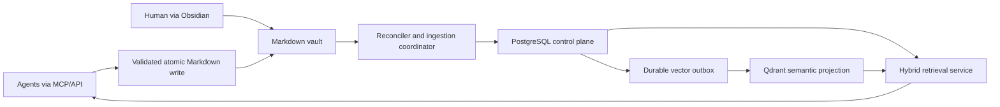

# Unified Agent Memory Reliability Design

## TL;DR

Keep Markdown as the authoritative shared memory, retain [[Qdrant]] for semantic search, and add [[PostgreSQL]] as the transactional control plane for document revisions, lexical retrieval, graph claims, profiles, provenance, indexing jobs, and current-versus-historical state.

## Approved Decisions

- Markdown and Obsidian remain the authoritative, Git-backup-friendly record.
- The first deployment runs on one machine and binds infrastructure to localhost.
- Agents write through UAMS MCP/API; humans may edit Markdown directly.
- Direct Markdown edits are reconciled automatically.
- Archived and superseded memories are excluded from normal retrieval.
- [[Qdrant]] remains the semantic vector engine.
- [[PostgreSQL]] provides exact and full-text retrieval, structured profiles, graph storage, revision state, provenance, and durable ingestion coordination.
- Redis, Neo4j, and pgvector are not required for this deployment.

## Current-State Audit

The audit inspected the repository, live Qdrant collections, generated graph, SDK/MCP adapters, watcher, API, and retrieval behavior. It also ran a ten-query repository-grounded retrieval probe.

| Finding | Measured state | Consequence |
|---|---:|---|
| Qdrant memory points | 1,410 | Existing vector investment is useful and should be retained. |
| Missing source files | 45 | Moved or deleted Markdown remains represented in derived stores. |
| Points from missing sources | 181 | Normal retrieval can return stale knowledge. |
| Heading-only chunks | 406 | Nearly 29% of vectors contain little useful evidence. |
| Points without entities | 1,132 | Graph-aware filtering has weak coverage. |
| Points with the date field read by retrieval | 0 | Temporal ranking is effectively disabled. |
| Knowledge graph nodes / edges | 619 / 616 | The graph has nontrivial size but weak semantics. |
| Factual graph relations | 0 | Every stored edge is a document-to-wikilink `references` edge. |
| Missing graph document nodes | 45 | Graph lifecycle is stale in the same way as Qdrant. |
| Golden probe hit@1 / hit@5 | 50% / 60% | Retrieval is not reliable enough for shared operational memory. |

### Root Causes

1. **Derived-state lifecycle is incomplete.** Ingestion upserts chunks but does not replace the complete prior document projection. Deletes, moves, removed chunks, and missed watcher events are not reconciled.
2. **The graph is a mention index, not a knowledge graph.** Wikilinks become document-reference edges. A `DiGraph` also collapses multiple relations and loses evidence and provenance.
3. **Graph instances are stale and fragmented.** The API router and retrieval pipeline load separate in-memory graphs at startup while the watcher writes a JSON file independently.
4. **Intent routing creates false negatives.** A heuristic routes each query to one Qdrant collection. Bug-fix questions therefore miss relevant episodic or semantic task outcomes.
5. **Search controls are not enforced.** `min_score` and requested collections are accepted by the API model but ignored. Graph expansion can emit dozens of internal `DOC:` nodes and issue useless entity-filter searches.
6. **Advertised reranking is absent in the installed runtime.** `sentence-transformers` is not installed, so the cross-encoder always falls back to heuristic word overlap.
7. **Health checks are shallow.** Health can report success without testing an embedding, vector write/read, full retrieval, or projection drift.
8. **Writes are not transactionally coordinated.** File naming and JSON graph updates use race-prone check-then-write and read-modify-write behavior.
9. **Memory editing pollutes or bypasses indexing.** Backup Markdown files can be indexed, move/delete events are not handled, and old projections survive archiving.
10. **Agent integration is optional and incomplete.** The local audit found UAMS configured for Claude and Hermes, but not Codex or OpenClaw. The MCP process also assumes the API is already running.
11. **Some documented subsystems are disconnected.** Seven memory types, consolidation, identity retrieval, and neural reranking are described more broadly than the serving path actually implements.
12. **Path handling is unsafe even on localhost.** Memory edit endpoints join caller-provided paths without enforcing that the resolved target remains inside the vault.

## Goals

- Make every active retrieval result traceable to an existing active Markdown revision.
- Preserve facts, decisions, bug fixes, procedures, user profiles, and agent profiles across agents.
- Recover automatically after process downtime, missed filesystem events, and database outages.
- Combine semantic, lexical, graph, profile, and temporal retrieval without brittle single-collection routing.
- Store graph claims with evidence, source revision, confidence, and validity.
- Provide measurable freshness, drift, retrieval-quality, and failure health signals.
- Preserve compatibility with existing MCP and SDK clients during migration.

## Non-Goals

- Multi-machine or public-network deployment.
- Redis caching, Redis queues, or distributed locking.
- Replacing Qdrant with pgvector.
- Adding Neo4j for a graph of this size.
- Storing raw conversations.
- Making LLM-extracted claims authoritative without verification.
- Making PostgreSQL or Qdrant the canonical memory source.

## System Architecture

### Markdown Vault

Markdown owns the content and durable history. Every managed memory receives a stable `memory_id` UUID in frontmatter. Moving a note therefore changes its path without changing its identity.

Managed frontmatter supports:

- `memory_id`
- `type`
- `status`: `active`, `superseded`, or `archived`
- `date`, `updated`, and optional `valid_from` / `valid_to`
- `tags`, `aliases`, and `entities`
- `source_agent` and optional `project`
- explicit structured relationships when the author knows a factual claim

Existing notes without `memory_id` are assigned deterministic IDs during migration and updated through a controlled migration command.

### Agent Write API

Agent writes are validated against the memory schema and written atomically using a temporary file, flush, filesystem sync, and rename. Filenames include a short UUID component, eliminating cross-agent check-then-write collisions.

The API returns the `memory_id`, Markdown path, and projection state. A successful Markdown write may return `index_status: pending` when projection services are unavailable; durable knowledge is not lost because reconciliation resumes later.

All caller paths are resolved and verified to remain inside the configured vault. API clients normally address memories by `memory_id`, not arbitrary filesystem paths.

### Reconciler and Ingestion Coordinator

The reconciler is the sole projection writer. Filesystem events only wake it; correctness does not depend on receiving every event.

It performs:

- a mandatory full content-hash scan at startup;
- periodic full reconciliation;
- per-document PostgreSQL advisory locking;
- idempotency by `memory_id` and content hash;
- explicit move, archive, restore, and delete detection;
- schema validation and quarantine;
- bounded retry with a dead-letter state;
- drift measurement across Markdown, PostgreSQL, and Qdrant.

### PostgreSQL Control Plane

PostgreSQL is a durable, rebuildable projection. It does not replace Markdown authority.

Core tables are:

- `documents`: stable memory identity, canonical path, type, status, and current active revision.
- `document_revisions`: content hash, parsed frontmatter, body projection, source agent, validity, ingest state, and errors.
- `chunks`: revision, order, heading hierarchy, useful content, token count, content hash, and generated `tsvector`.
- `entities`: normalized canonical identity and entity type.
- `entity_aliases`: normalized aliases mapped to canonical entities.
- `mentions`: chunk-to-entity wikilink occurrences.
- `claims`: subject, controlled predicate, object entity or value, evidence span, source revision, confidence, validity, and verification status.
- `profiles`: user or agent profile identity and current materialized revision.
- `profile_facts`: structured key/value facts with evidence, confidence, validity, and source revision.
- `ingestion_jobs`: retryable state and diagnostics for every discovered revision.
- `vector_outbox`: committed commands that Qdrant workers process idempotently.
- `memory_audit_events`: append-only write, edit, archive, restore, and projection events.

GIN indexes support PostgreSQL full-text search. B-tree and partial indexes support active status, memory type, profile, project, validity, and revision filters.

### Qdrant Semantic Projection

Qdrant stores embeddings in one new collection, `memory_chunks_v2`. Searching all active memory types by default prevents intent-routing false negatives.

Each point contains:

- a stable `chunk_id`;
- `memory_id` and `revision_id`;
- memory type, project, source agent, and timestamps;
- canonical entity IDs and tags;
- chunk text and source heading for evidence display.

The vector worker upserts a complete staged revision, records the acknowledgement in PostgreSQL, and only then activates the revision. Old vectors are removed after activation. PostgreSQL validation filters any stale Qdrant candidate that does not belong to the current active revision.

## Revision Activation and Failure Recovery

Revision states are `discovered`, `validated`, `staged`, `vectorized`, `active`, `retryable`, `quarantined`, and `superseded`.

1. Reconciliation discovers a new content hash.
2. Validation parses frontmatter and rejects unsafe or malformed input.
3. One PostgreSQL transaction stages the revision, chunks, FTS projection, mentions, claims, profile facts, job state, and vector outbox.
4. The vector worker creates embeddings and upserts Qdrant points idempotently.
5. After Qdrant acknowledgement, PostgreSQL atomically marks the new revision active and the old revision superseded.
6. Cleanup removes old Qdrant points.

If PostgreSQL, Qdrant, or the embedding provider fails, the previous active revision remains searchable. Retry resumes from the last safe stage. Malformed Markdown is quarantined with a precise error and never replaces a valid active projection.

## Knowledge Graph Design

Wikilinks create **mentions**, not factual relations. Mentions help discover candidate entities but cannot influence causal graph boosts by themselves.

Factual **claims** include:

- canonical subject;
- predicate from a controlled vocabulary such as `uses`, `depends_on`, `fixes`, `caused_by`, `part_of`, and `prefers`;
- canonical object entity or typed literal value;
- quoted evidence span or structured frontmatter source;
- source document and revision;
- confidence and verification status;
- valid-from and valid-to timestamps.

Explicit structured frontmatter claims enter as `explicit`. Conservative deterministic extraction may also create explicit claims. LLM extraction produces `candidate` claims only. Normal graph expansion uses `explicit` and `verified` claims; candidate claims remain inspectable but cannot alter retrieval ranking.

Entity resolution normalizes whitespace and Unicode, uses case-folded keys, and maps aliases to a single canonical entity without discarding the displayed name.

## Profiles

User profiles remain canonical Markdown in `People/`. Agent profiles use canonical Markdown under `Agents/`. PostgreSQL materializes their current structured facts for exact retrieval, authorization context, and conflict resolution.

Qdrant also embeds profile narrative chunks, enabling loosely worded semantic questions. PostgreSQL remains responsible for selecting the current, supported fact and exposing its source evidence.

## Hybrid Retrieval

Normal search executes these steps:

1. Normalize the query and resolve entity aliases.
2. Query `memory_chunks_v2` in Qdrant without forcing one memory type.
3. Query PostgreSQL full-text indexes and structured profile fields.
4. Expand only explicit or verified graph claims.
5. Remove candidates whose document revision is not current and active.
6. Fuse semantic and lexical rankings using reciprocal-rank fusion.
7. Apply bounded graph, profile, project, and recency boosts.
8. Run the configured cross-encoder when available and report its real health state.
9. Deduplicate by memory and evidence span, enforce `min_score`, and assemble token-bounded context.

Historical search is opt-in and may include archived or superseded revisions. Default search never does.

## API and Compatibility

Existing `/search`, `/context`, `/remember`, `/procedures`, graph, identity, and MCP tool contracts remain available through compatibility adapters.

The enhanced API adds:

- explicit `historical`, `memory_types`, `projects`, `profile_ids`, and status filters;
- projection status in write responses;
- ingestion job and drift status;
- readiness separate from liveness;
- evidence and revision identifiers in search results;
- current profile facts with source evidence.

The MCP `begin_task` and `end_task` lifecycle remains the required agent boundary. Integration tooling reports each supported client as configured, missing, invalid, or unreachable instead of assuming success.

## Deployment

Docker Compose runs two localhost-only infrastructure services:

- the existing Qdrant service with a pinned tested image instead of `latest`;
- PostgreSQL 16 with a named persistent volume, health check, and application-specific database credentials.

The FastAPI service, reconciler, MCP adapter, and Ollama remain host-side on macOS. This preserves reliable filesystem events and Apple Silicon model acceleration. `./uams start` starts Docker infrastructure, applies database migrations, starts host services, performs readiness checks, and launches reconciliation.

Redis is unnecessary because PostgreSQL supplies durable jobs, advisory locks, transactions, and local notification through `LISTEN/NOTIFY`.

## Observability

Health and status surfaces report:

- PostgreSQL and Qdrant readiness;
- real embedding and semantic-search probes;
- cross-encoder loaded versus fallback state;
- pending, retrying, quarantined, and dead-letter job counts;
- oldest projection lag;
- Markdown-to-PostgreSQL document and revision drift;
- PostgreSQL-to-Qdrant chunk and revision drift;
- active, historical, candidate, explicit, and verified claim counts;
- retrieval evaluation results from the last golden-set run.

## Testing and Acceptance

### Unit Tests

- frontmatter schema and safe path resolution;
- atomic filename generation;
- stable IDs and content-hash idempotency;
- chunking that rejects heading-only chunks;
- entity normalization and alias resolution;
- mention versus claim extraction;
- status, temporal, historical, and score filtering;
- reciprocal-rank fusion and result deduplication.

### Integration Tests

Real Docker PostgreSQL and Qdrant instances verify migrations, staging, vector outbox delivery, activation, supersession, archive behavior, and full-text/vector fusion.

### Failure Tests

- terminate Qdrant after staging and confirm the old revision remains active;
- terminate PostgreSQL around a Markdown write and confirm reconciliation recovers it;
- restart after missed filesystem events and confirm convergence;
- inject malformed Markdown and confirm quarantine;
- perform parallel writes and confirm no overwrite or duplicate active revision;
- move, archive, restore, and delete notes and confirm exact projection state.

### Retrieval Evaluation

The current ten-query probe is converted into a committed golden dataset and expanded with profile, graph, historical, contradiction, and exact-match cases.

Release gates are:

- hit@1 of at least 80%;
- hit@5 of at least 90%;
- zero deleted, archived, or superseded results in default search;
- zero lost writes after forced restart and dependency failures;
- zero projection drift after reconciliation;
- every graph-boosted result traceable to explicit or verified evidence.

## Migration and Rollback

1. Snapshot the current Markdown vault, Qdrant volume, and graph JSON.
2. Add PostgreSQL and apply schema migrations.
3. Build the PostgreSQL projection and `memory_chunks_v2` from Markdown without changing live reads.
4. Run drift checks and the golden retrieval evaluation in shadow mode.
5. Switch retrieval to PostgreSQL plus `memory_chunks_v2` only after release gates pass.
6. Keep old Qdrant collections and graph JSON read-only for one rollback window.
7. Remove legacy projections only after explicit acceptance.

Rollback switches the compatibility retrieval adapter back to the old collections. Markdown is never migrated away and remains unaffected.

## Expected Outcome

Every participating agent sees one coherent, current shared memory through MCP/API. Semantic recall continues to benefit from Qdrant, while PostgreSQL supplies the exact state, profiles, graph evidence, lifecycle, and recovery guarantees that the current file-plus-JSON architecture lacks.
